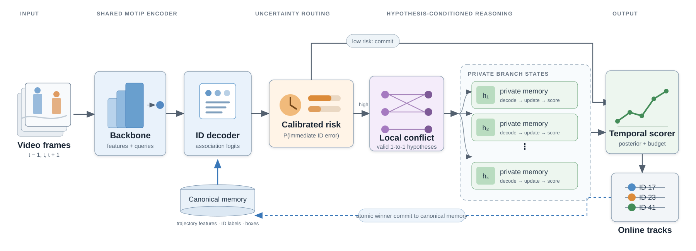
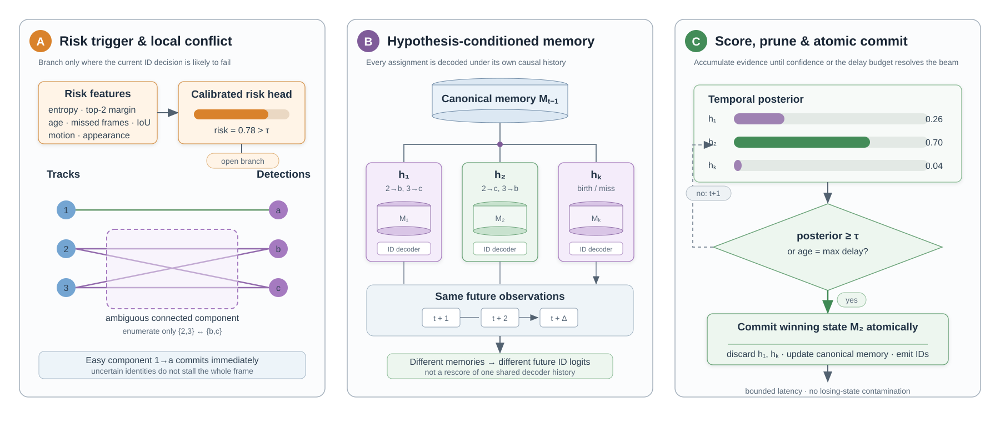

# BranchMOT

**Calibrated delayed-commitment identity reasoning for online multi-object tracking**

[Method](#method) · [Architecture](#architecture) · [Training](#training) · [Experiments](#experimental-plan) · [Status](#implementation-status) · [Run](#quick-start)

> **Research status:** BranchMOT is an active research prototype built around
> [MOTIP](https://github.com/MCG-NJU/MOTIP). The branching engine, reversible
> state adapter, cache/replay pipeline, evaluation utilities, training losses,
> and deterministic tests are implemented. Results on DanceTrack and MOT17
> have not yet been measured, so this repository does not claim benchmark gains.

## One-minute overview

Most online trackers must permanently assign an identity at the current frame.
That is efficient when the evidence is clear, but brittle during crossings,
occlusion recovery, and interactions between visually similar targets. A single
uncertain assignment can both create an identity switch and write the wrong
observation into long-term track memory.

BranchMOT changes only the difficult part of this process:

1. **Commit immediately on easy frames.** A calibrated risk head estimates the
   probability that the current identity decision is wrong.
2. **Branch locally on ambiguous frames.** The tracker builds a small set of
   valid one-to-one assignments only inside the conflicting track/detection
   component.
3. **Give every hypothesis a private memory.** Each branch owns its own MOTIP
   ID-prompt and trajectory state. Future frames are decoded under that branch's
   history, rather than rescoring one shared history.
4. **Resolve with future causal evidence.** Branches accumulate evidence until
   one is sufficiently likely or a strict delay budget is reached.
5. **Commit atomically.** Only the winning memory replaces the canonical online
   state; losing branches cannot contaminate it.

The intended outcome is better post-occlusion identity continuity without
turning online tracking into expensive full-video optimization.

## Research question and hypothesis

**Question.** Can an online tracker reduce post-occlusion identity switches by
delaying only uncertain local associations and using a few future frames, while
preserving bounded latency and practical compute?

**Hypothesis.** A small, uncertainty-triggered beam of
**hypothesis-conditioned memories** will outperform immediate commitment in
ambiguous identity events. The advantage should be concentrated in hard
crossings and occlusion recovery, not in already-easy frames.

This hypothesis is deliberately falsifiable: the method is useful only if any
association gain survives identical detections, sequence-level evaluation,
multiple seeds, and explicit compute/latency accounting.

## Why the project is called BranchMOT

`Branch` refers to branching the tracker's possible identity histories. `MOT`
is multi-object tracking. The name captures the core distinction from ordinary
beam rescoring: every live branch carries a different internal identity memory,
so later observations are interpreted under different causal histories.

## Method

Let the baseline tracker produce an association distribution
`P(ID | observation, memory)` for the detections in frame `t`.

### 1. Calibrated risk trigger

A lightweight head predicts the chance that immediate commitment will be
incorrect. Its inputs can include top-2 margin, entropy, newborn probability,
conflict size, track age, missed-frame count, overlap, motion disagreement, and
appearance similarity. Branching opens only when estimated risk exceeds a
validation-selected threshold.

This is different from treating raw entropy as calibrated uncertainty. The risk
head is trained with a Brier objective and evaluated with ECE, NLL, Brier score,
and risk-coverage curves.

### 2. Sparse conflict decomposition

Association candidates form a bipartite graph between active tracks and current
detections. The graph is decomposed into connected conflict components. Clear
components are committed normally; only a small ambiguous component is
enumerated. Every candidate must satisfy one-to-one assignment constraints and
may include track continuation, missed tracks, and newborn identities.

### 3. Hypothesis-conditioned memory branching

For each retained local assignment `h_k`, BranchMOT forks the relevant MOTIP
runtime state:

- trajectory object features and masks;
- internal trajectory identity labels;
- boxes, age, and disappearance counters;
- stable-ID mappings and recycled/free labels;
- decoder caches that depend on earlier assignments.

The ID decoder is then run separately under every private memory. This matters:
if all candidates reuse logits produced from one shared history, future evidence
cannot reveal how an earlier identity choice changed the tracker itself.

### 4. Temporal scoring and bounded commitment

Each branch accumulates a learned path score from identity likelihood, motion,
appearance, optional mask consistency, and relational cues. The beam keeps at
most `K` branches (default `K = 4`) and can retain hypotheses until their
posterior mass reaches the configured budget.

A decision is committed when either:

- the leading branch posterior exceeds the confidence threshold; or
- the maximum delay is reached.

The delay is therefore selective and bounded, rather than a fixed look-ahead
applied to every frame.

### 5. Transactional state commit

`MOTIPStateAdapter` restores a branch state before decoding or updating it and
restores the canonical state afterwards, including on failure. Once a winner is
chosen, its complete successor state is committed atomically. The initial
correctness-first implementation clones complete tensor state; conflict-column
copy-on-write is the planned efficiency optimization.

## Architecture

<p align="center">
  
</p>

<p align="center"><em>Figure 1. BranchMOT overview. Easy frames follow the
immediate MOTIP path; only a high-risk local conflict opens a bounded beam of
hypothesis-conditioned trajectory memories. Future evidence scores the private
histories before the winner is committed to canonical online state.</em></p>

The network is mostly the pretrained MOTIP detector, trajectory model, and ID
decoder. BranchMOT adds a risk head, local hypothesis generator, private-memory
manager, and branch scorer. The detector remains frozen in the first training
iteration so that the experiment isolates association reasoning.

### Main component details

<p align="center">
  
</p>

<p align="center"><em>Figure 2. Main components. (A) Calibrated risk opens
branching only for an ambiguous connected component. (B) Each valid assignment
owns a private memory and re-decodes the same future observations. (C) The beam
is pruned by temporal posterior until confidence or the delay budget triggers an
atomic winner commit.</em></p>

## Training

The starting point is a released MOTIP checkpoint. Training uses 12-frame clips:
four warm-up frames establish trajectories, one frame opens a conflict, up to
four future frames resolve it, and the remaining frames provide context.

The proposed clip mixture is:

| Clip type | Share | Purpose |
|---|---:|---|
| Hard conflicts | 50% | Small top-2 margin, competing detections, or an incorrect immediate assignment |
| Occlusion recovery | 25% | Learn identity continuity after disappearance/reappearance |
| Ordinary tracking | 25% | Preserve normal performance and calibrate false alarms |

At training time, valid local assignments are enumerated and the
ground-truth-continuous candidate is inserted if necessary. Every retained
candidate is unrolled under its own memory. Ground truth selects the oracle
branch for supervision only; it is never available during inference.

### Objective

For branch score `S_k` and ground-truth-continuous branch `k*`:

```text
L = L_id
  + 0.5 L_rank
  + 0.2 L_risk
  + 0.01 E[number of live branches]
  + 0.01 E[decision delay]

L_rank = -log softmax(S)[k*]
L_risk = (sigmoid(r) - 1[immediate decision is wrong])^2
```

- `L_id`: normal MOTIP identity cross-entropy on the oracle memory branch and
  ordinary clips.
- `L_rank`: teaches the scorer which causal identity history is consistent.
- `L_risk`: calibrates the branch trigger as an error probability.
- compute and delay terms prevent accuracy gains obtained only through an
  impractically large beam or look-ahead.

### Three-stage schedule

1. **Risk calibration (5 epochs):** freeze MOTIP and train only the risk head
   from cached features.
2. **Branch discrimination (12 epochs):** freeze the detector; train the branch
   scorer, memory updater, and ID decoder with GT-injected candidate sets.
3. **Budget-aware fine-tuning (6 epochs):** jointly fine-tune the new heads and
   ID decoder while increasing compute and delay penalties.

The concrete starting configuration is
[`configs/dancetrack_branch_training.yaml`](configs/dancetrack_branch_training.yaml),
and the implementation of the composite loss is
[`integrations/motip/branch_losses.py`](integrations/motip/branch_losses.py).

## Experimental plan

### Datasets and protocol

The first full study targets both:

- **DanceTrack:** highly similar appearances, non-linear motion, crossings, and
  group interactions; this is the main stress test for association reasoning.
- **MOT17:** a standard pedestrian benchmark with different detectors and
  crowded scenes; this tests whether the mechanism generalizes beyond the
  DanceTrack motion regime.

All primary baseline/BranchMOT comparisons will use identical detections.
Videos are split by sequence before mining training clips. Validation selects
thresholds; test data is not used for tuning. Learned heads will be run with at
least three seeds and variation reported.

### Metrics

| Question | Measurements |
|---|---|
| Tracking accuracy | HOTA, DetA, AssA, IDF1, MOTA |
| Identity failures | ID switches and fragmentation |
| Hard-event behavior | Post-occlusion recovery by occlusion length, crowd density, and appearance similarity |
| Calibration | ECE, NLL, Brier score, reliability diagram, risk-coverage curve |
| Online cost | Mean/P95 decision delay, mean/max live branches, FPS, peak GPU memory |

### Core baselines

1. Released MOTIP with immediate identity commitment.
2. Immediate Hungarian assignment from the same cached probabilities.
3. Delayed beam over fixed cached logits (no private memories).
4. BranchMOT with hypothesis-conditioned private memories.

The comparison between 3 and 4 is especially important: it isolates whether
the contribution comes from delaying a decision or from decoding future
evidence under genuinely different identity histories.

### Required ablations

| Factor | Values |
|---|---|
| Beam size | 1, 2, 4, 8 |
| Maximum delay | 0, 2, 4, 8, 16 frames |
| Branch trigger | entropy, margin, calibrated risk |
| Memory update | always, hard gate, soft gate |
| Future decoder | fixed cached logits, hypothesis-conditioned memory |
| Search scope | global, local conflict component |
| Branch budget | fixed K, posterior-mass adaptive |
| Path cues | identity likelihood, motion, appearance, mask, relations |

### Success and falsification criteria

The central claim is supported only if BranchMOT produces a repeatable AssA or
IDSW improvement on real data, concentrated in ambiguous/post-occlusion
events, while keeping the chosen latency and compute budget. If gains disappear
under identical detections, fail to transfer from DanceTrack to MOT17, or
require excessive delay, the hypothesis is not supported in its current form.

## Implementation status

| Component | Status | Evidence in this repository |
|---|---|---|
| Ambiguity-triggered top-K association | Implemented | `association.py`, deterministic crossing tests |
| Local conflict decomposition and lifecycle hypotheses | Implemented | `conflicts.py`, `lifecycle.py` |
| Short-term observation-chain linking | Implemented | `linking.py` |
| MOTIP probability/state capture | Implemented | `motip_tap.py`, `motip_adapter.py` |
| Private trajectory-memory branching | Implemented | `branch_memory.py` |
| Transactional MOTIP state fork/restore/commit | Implemented | `motip_state.py` |
| MOTIP private-branch decoder/controller | Implemented | `motip_branch.py` |
| Official-vs-replay equivalence gate | Implemented at adapter boundary | `motip_equivalence.py`; must pass against the selected upstream checkout |
| Causal GT annotation and identity evaluation | Implemented | `mot_ground_truth.py`, `identity_targets.py`, `evaluate.py` |
| Differentiable ID/rank/risk/budget loss | Implemented | `integrations/motip/branch_losses.py` |
| Synthetic occlusion-delay stress test | Implemented | `synthetic.py`, checked-in reference CSV |
| Full DanceTrack/MOT17 training | Pending GPU run | configuration and protocol are ready |
| Official benchmark results | Pending | no real-data performance claim yet |

The checked-in synthetic reference run verifies the expected mechanism and the
latency/accuracy trade-off in a controlled crossing generator; it is **not**
evidence of real benchmark performance. See
[`docs/synthetic_benchmark.md`](docs/synthetic_benchmark.md).

## Correctness safeguards

- The first appearance of a target is never labelled using its current-frame GT
  identity; evaluation separates GT matching coverage from causally evaluable
  identity coverage.
- A failed private decode cannot leak partial state into the canonical tracker.
- Stable output IDs, recycled internal labels, disappearance counters, and
  trajectory tensors are included in state-equivalence checks.
- Real experiments must pass framewise equivalence against unmodified MOTIP
  before branching is enabled.
- Baseline and BranchMOT results use identical detector outputs unless a result
  is explicitly labelled otherwise.

See [`docs/MOTIP_INTEGRATION.md`](docs/MOTIP_INTEGRATION.md) for the exact
integration boundary and equivalence protocol.

## Quick start

The core package is lightweight and can be tested without a GPU:

```bash
python -m pip install -e ".[dev]"
pytest
```

Validate a planned real experiment:

```bash
branchmot-preflight \
  --motip-root /path/to/MOTIP \
  --data-root /path/to/datasets \
  --checkpoint /path/to/r50_deformable_detr_motip_dancetrack.pth
```

Run the deterministic crossing/occlusion sweep:

```bash
branchmot-synthetic \
  --occlusion-lengths 1 2 4 8 \
  --max-delays 2 4 8 16 \
  --episodes 200 \
  --seed 42
```

Evaluate a cached MOTIP sequence:

```bash
branchmot-evaluate outputs/branchmot_cache/sequence.jsonl \
  /path/to/DanceTrack/val/sequence/gt/gt.txt \
  --annotated-cache outputs/branchmot_cache/sequence.annotated.jsonl \
  --output results/sequence.identity.json
```

## Repository map

```text
src/branchmot/                 Core branching, memory, replay, and evaluation
integrations/motip/            MOTIP hooks, loss, and integration examples
configs/                       MVP and hypothesis-conditioned training configs
tests/                         Deterministic unit and integration-boundary tests
benchmarks/reference/          Synthetic mechanism reference output
docs/TRAINING.md               Detailed training recipe
docs/MOTIP_INTEGRATION.md      Upstream integration and equivalence gate
docs/research_plan.md          Staged study and ablation plan
docs/CLOUD_GPU.md              Reproducible remote-GPU workflow
```

## Compute request

The remaining work requires one CUDA GPU and persistent storage for MOTIP,
checkpoints, DanceTrack, and MOT17. A 24 GB GPU is a practical minimum for the
initial frozen-detector experiments with mixed precision and gradient
accumulation; 40–48 GB provides safer room for multiple private trajectory
memories. The core CPU-only tests should be run before allocating GPU time.

## Candidate contributions

Subject to experimental validation, the paper contribution would be:

1. **Selective delayed commitment:** an online formulation that spends future
   evidence only on calibrated high-risk identity conflicts.
2. **Hypothesis-conditioned trajectory memory:** competing assignments are
   decoded under private causal histories, not merely rescored from shared
   logits.
3. **Safe bounded execution:** sparse conflict search, posterior/beam budgets,
   bounded delay, and atomic memory commit.
4. **Calibration-aware analysis:** tracking accuracy is reported together with
   error-risk calibration, coverage, latency, branch count, and GPU cost.

These are candidate research claims, not claims of novelty priority or
state-of-the-art performance. Related multiple-hypothesis, delayed-decision,
and memory-based tracking literature must be compared explicitly in the paper.

## References and upstream resources

- [MOTIP: Multiple Object Tracking as ID Prediction (CVPR 2025)](https://github.com/MCG-NJU/MOTIP)
- [DanceTrack: Multi-Object Tracking in Uniform Appearance and Diverse Motion (CVPR 2022)](https://github.com/DanceTrack/DanceTrack)
- [MOTChallenge](https://motchallenge.net/)
- [HOTA: A Higher Order Metric for Evaluating Multi-Object Tracking](https://arxiv.org/abs/2009.07736)

## Current limitations

- No DanceTrack or MOT17 training/evaluation has been completed yet.
- Full-state cloning is a correctness reference and will be slower than the
  planned conflict-local copy-on-write implementation.
- The current observation-chain linker uses motion, IoU, and centre-distance
  cues; mask/flow propagation is not yet implemented.
- The strength and novelty of the contribution depend on real-data ablations,
  calibration quality, and comparison with the closest hypothesis-tracking
  literature.

## License

MIT for the BranchMOT code in this repository. MOTIP, datasets, checkpoints,
and third-party components retain their own licences and terms.

